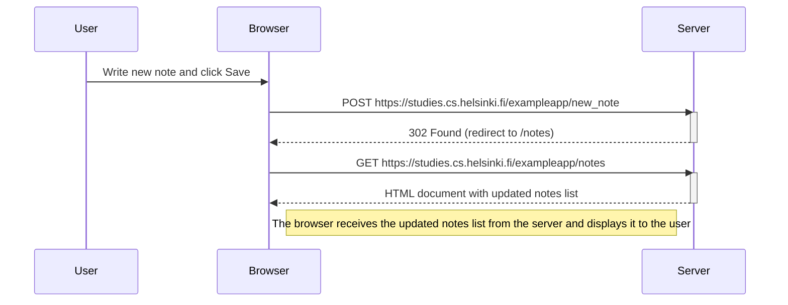
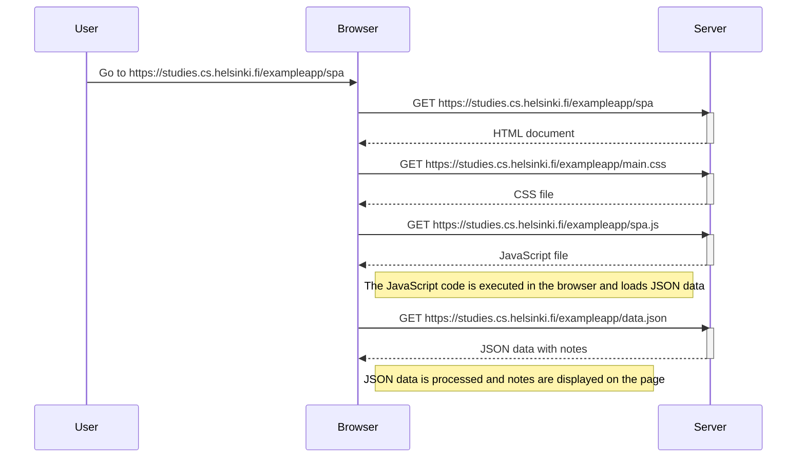
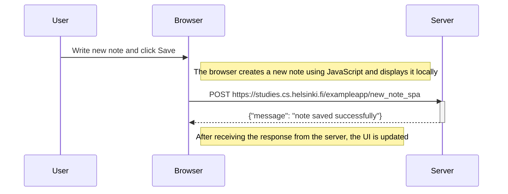

Certainly! Here’s the complete set of instructions and diagrams combined into one Markdown file, written in English, for your assignment. This will include both the diagrams and the instructions on how to submit them.

### Markdown Content for Your Assignment

Create a Markdown file named `exercise.md` with the following content:

````markdown
# Exercise 0.4: New Note Diagram


````

# Exercise 0.5: Single Page App Diagram



# Exercise 0.6: New Note in Single Page App Diagram



### How to Submit Your Assignment

1. **Create a Markdown File:** Save the above content into a Markdown file named `exercise.md` on your computer.

2. **Create a GitHub Repository:**

   - Go to [GitHub](https://github.com/aytekinkaplan/helsinki-university) and log in.
   - Click on the `+` icon at the top right and select `New repository`.
   - Name the repository something meaningful, like `mermaid-diagrams-homework`.
   - Set the repository to public (unless otherwise instructed) and click `Create repository`.

3. **Upload Your Markdown File to GitHub:**

   - In your new repository, click on `Add file` and select `Upload files`.
   - Drag and drop your `exercise.md` file into the upload area or use `choose your files` to select the file from your computer.
   - Write a commit message, such as `Added exercise diagrams`.
   - Click `Commit changes` to save the file in your repository.

4. **Submit the Assignment:**

   - Copy the URL of your GitHub repository (e.g., `https://github.com/aytekinkaplan/mermaid-diagrams-homework`).
   - Submit this URL through your course's submission system or send it to your instructor as per the assignment instructions.

5. **Final Checks:**
   - **Preview the Markdown File:** Make sure the diagrams render correctly on GitHub by viewing your `exercise.md` file in your repository.
   - **Double-check the submission link:** Ensure that you have copied the correct URL and that the repository is accessible (if set to public).

By following these steps, you will complete your assignment and submit it correctly. If you have any additional questions or need further assistance, please feel free to ask!
